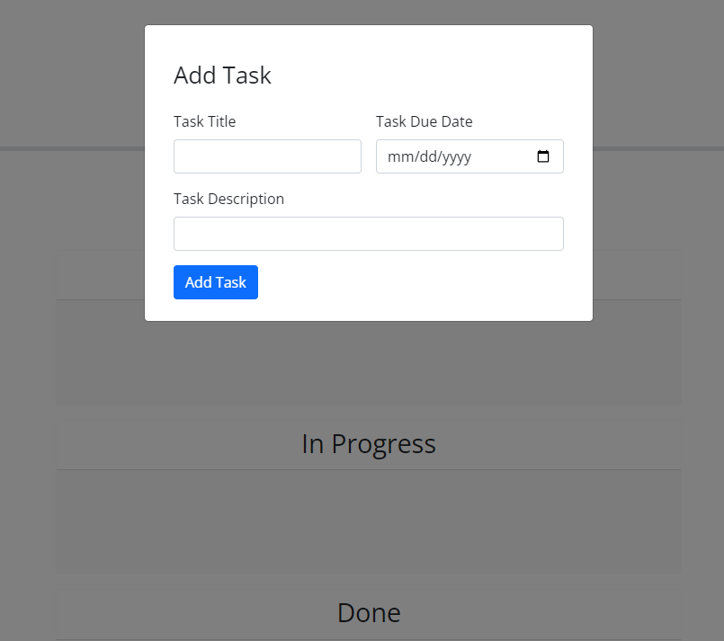

# task-board

## Description 
This project creates a to-do list task board that allows arragement of tasks. The tasks can be placed in to-do, in-progress, and done. It also color coordinates the cards when they are past due and done. 

## Usage

[Link to Deployed App] (https://bamartin0.github.io/task-board/)